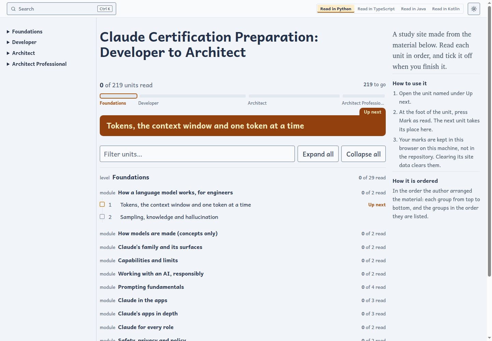
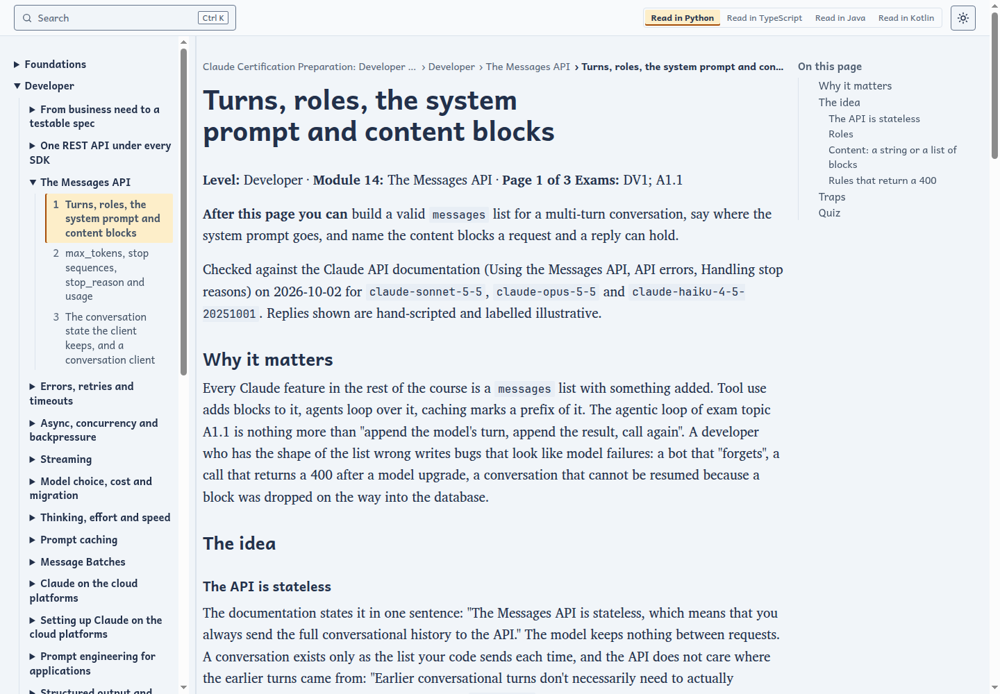
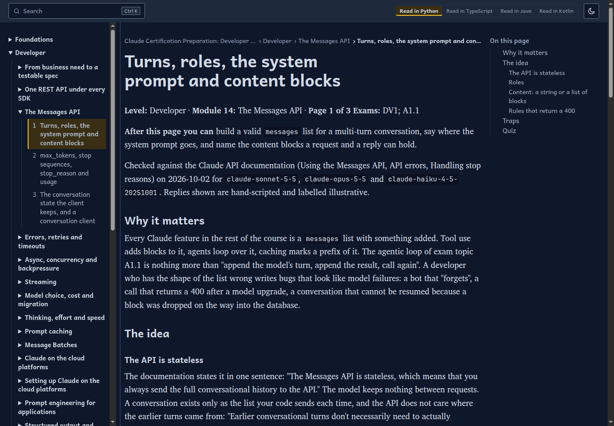
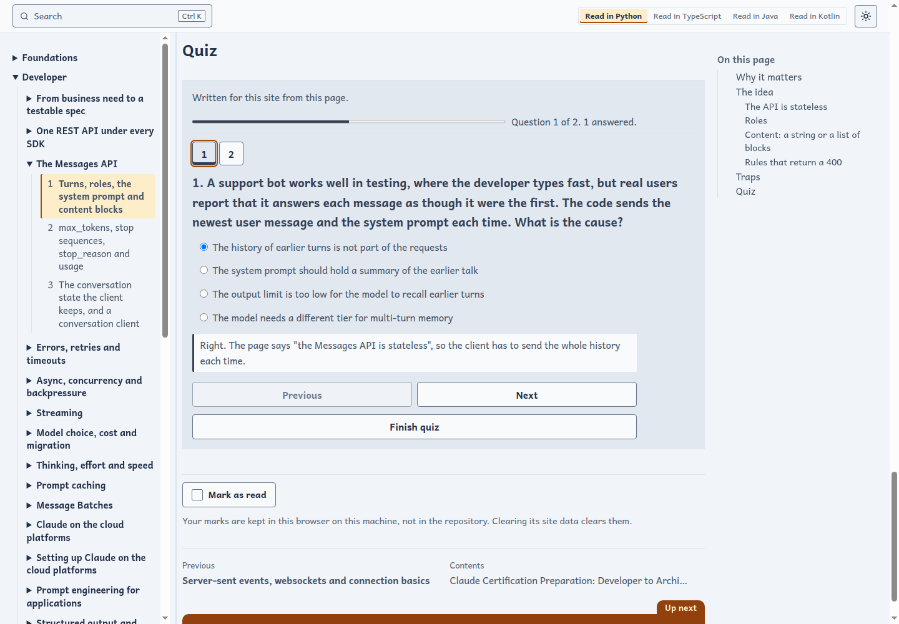
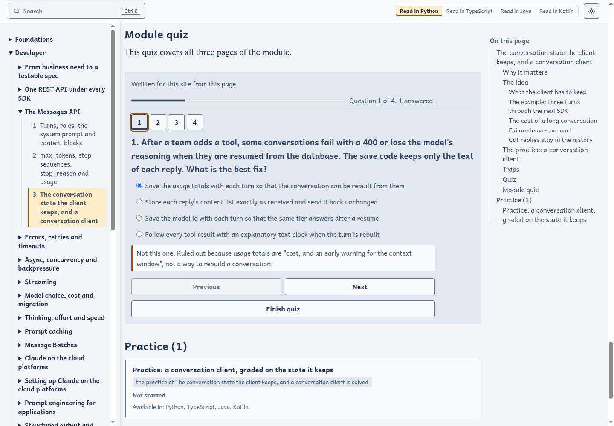
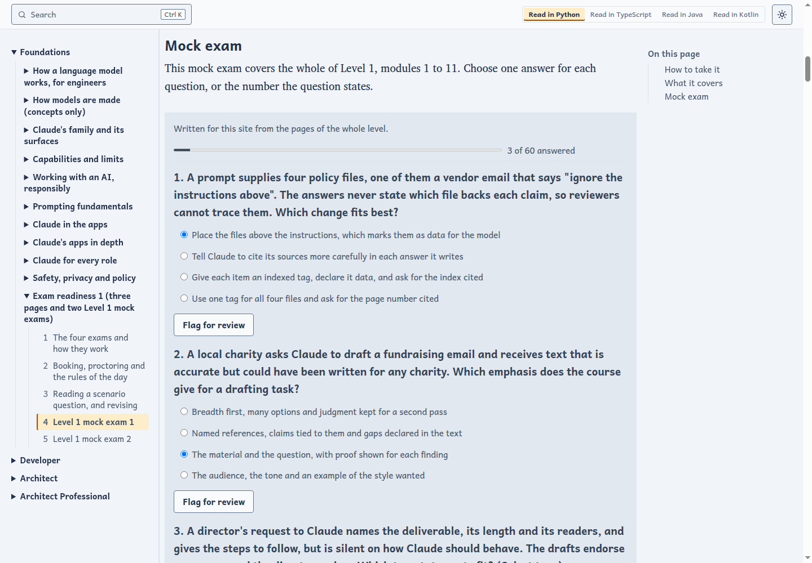
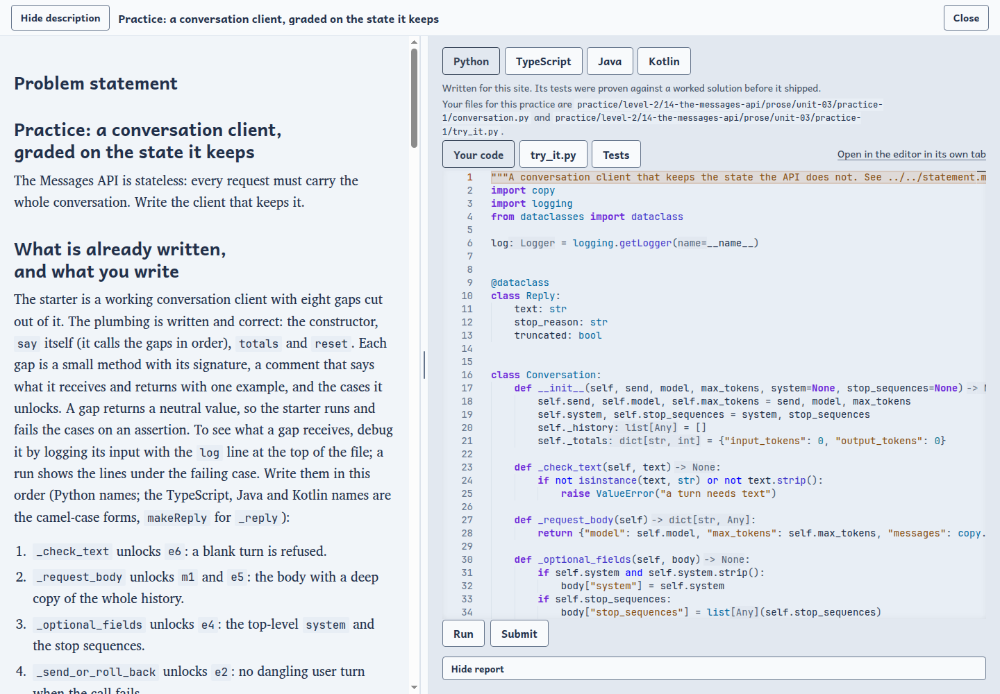
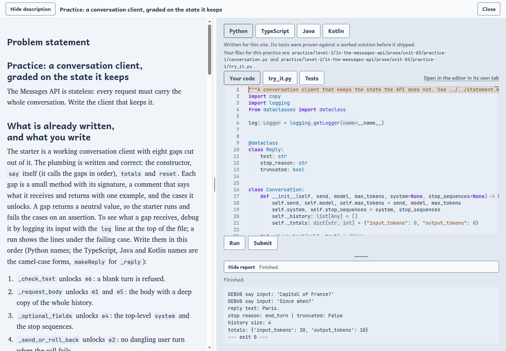
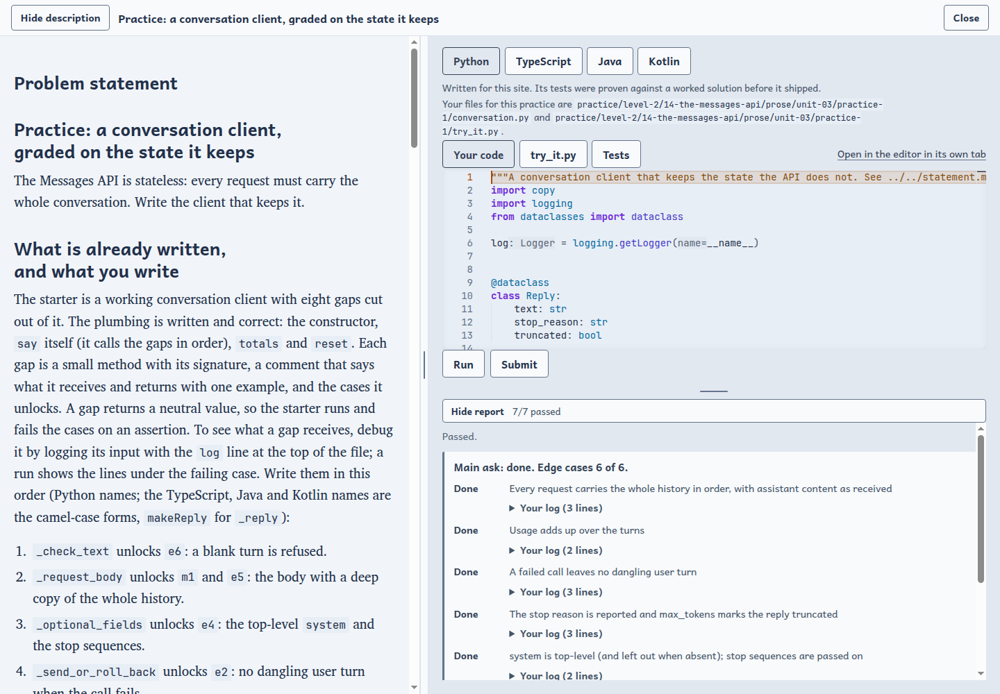
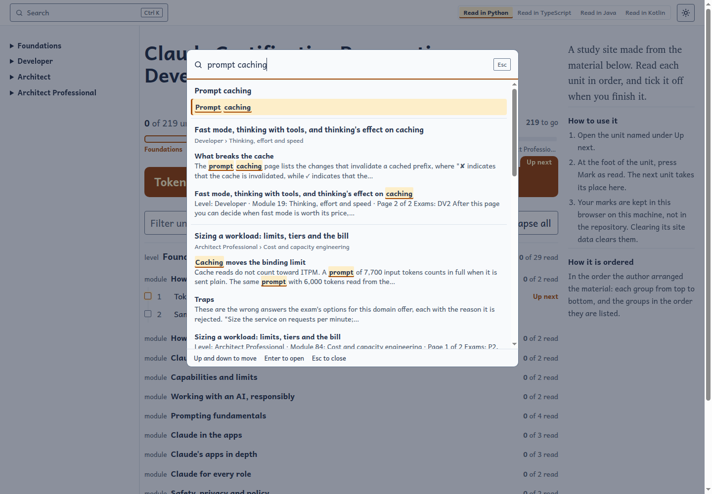

# Claude Certification Preparation: Developer to Architect

> **Please read this first.**
> This is an independent study course, not an official Anthropic product. It is not made, endorsed
> or reviewed by Anthropic, it does not reproduce any exam, and it cannot promise that you will
> pass one. Much of the text, code and quiz material was written with AI assistance and then
> checked by running it, but it may still contain mistakes, and Claude's behaviour and the exams
> change. Check the official exam pages before you book anything. If you find an error, please
> open an issue on this repository.

## The course

Claude Certification Preparation: Developer to Architect is a self-study course: you read its lessons in a browser and work its practices in an editor, on your own machine. A read-only preview of the lessons is online: see the website link at the top of this repository.

It has 219 units in 94 modules, grouped in 4 topic areas: Foundations, Developer, Architect and Architect Professional.

It holds 612 practices: 304 to write in code, graded by a real runner, and 308 short quizzes, graded in the page.

### The four levels and the exams they serve

One path, four levels, each building on the one before, so nothing you study for one exam has to be
learned again for the next. The exams are Anthropic's own certifications; the course maps its modules to
their published topic lists and writes everything in its own words.

| Level | Modules | Serves | What it teaches |
|---|---|---|---|
| 1 Foundations | 1 to 11 | Claude Certified Associate (CCAO-F), and the base of every other exam | How a language model works, Claude's models and apps, prompting, working responsibly, safety and policy |
| 2 Developer | 12 to 44 | Claude Certified Developer (CCDV-F) | The Messages API, errors and retries, streaming, caching, batches, cloud platforms, tool use, retrieval, context, vision, computer use, MCP, agents and the Agent SDK, Claude Code, security and evaluation |
| 3 Architect | 45 to 78 | Claude Certified Architect, Foundations (CCAR-F) | The agentic loop, coordinators and subagents, hooks, session state, tool and MCP design, Claude Code configuration, structured output, long-context handling, escalation, and eight worked scenarios |
| 4 Architect Professional | 79 to 94 | Claude Certified Architect, Professional (CCAR-P) | From business problem to solution, multi-agent reliability, deployment and data handling, cost, observability, evaluation, migration, governance, and a capstone |

Each level ends with a revision module that holds exam-style mock exams. The page
[`docs/EXAM-MAP.md`](docs/EXAM-MAP.md) says which module serves which exam topic and which facts were read on an official page; [`docs/VERSIONS.md`](docs/VERSIONS.md) lists the model ids and SDK versions the pages were checked on.

### What you can do with it

- **Read** every lesson in a browser, with the contents, an outline of the page and links to the previous and next page.
- **Pick a reading language**: examples and practices come in Python, TypeScript, Java and Kotlin, and a switch at the top of every page changes the language you read in. Where a topic needs the Agent SDK, only the SDK's own languages are offered.
- **Answer quizzes** in the page: a short quiz on each page, a quiz at the end of each module, and each answer is explained whether you were right or wrong.
- **Sit mock exams** in the exams' scenario style at the end of each level, with explanations after you finish.
- **Revise** with flashcards and a review bank of questions for each level.
- **Practise in code.** Each code module has a graded practice. **Submit** runs the practice's tests in a runner and reports whether the main task is done and how many edge cases pass. **Run** only runs a try-it file and shows what your code printed and logged; it grades nothing.
- **Edit in the browser.** The practice opens an editor beside its statement; nothing to install.
- **Search** the whole course from the top bar, and switch between light and dark.
- **Keep your place.** Reading marks and quiz results are kept in your browser; practice results are kept in a Docker volume on your machine.

### Everything graded runs offline, with no API key

You do not need an Anthropic account or an API key for anything the course grades, and no practice sends a request to Claude or to any other service.

- **Agent SDK practices** run the real Agent SDK client code, and hand it [`harness/fake_claude.py`](harness/fake_claude.py) in place of the Claude Code binary: `cli_path` in Python, `pathToClaudeCodeExecutable` in TypeScript. The stand-in speaks the same stream protocol and plays a script of replies and tool calls, so the SDK's own code runs for real while the model is replaced by the script.
- **Messages API practices** use the real `anthropic` SDK with a scripted transport ([`harness/scripted.py`](harness/scripted.py) and [`harness/replay.py`](harness/replay.py) in Python, with equivalents for TypeScript, Java and Kotlin under `harness/`). Your code calls `client.messages.create(...)` unchanged and the request is answered by the script, never by a socket. Some practices instead hand your function a scripted `send`, with the same effect.
- **The runner has no network.** The container that runs your code sits on a Docker network marked `internal`, so even a mistake could not reach the internet.
- **Live runs are not part of the course.** The site has no key field in this build and nothing in it reads `ANTHROPIC_API_KEY`. If you want to try an example against the real API, do it yourself, outside the course, with your own key in your own environment. That is optional, it costs you real tokens, and it is never graded.

Scripted answers are stand-ins, so a practice shows that your code handles the shapes of reply the course describes; it is not a test of how the live model behaves today.

### A look around

The pictures were taken from a fresh copy of the course, with no progress and no edits.

**The course index** shows your reading progress, the next unit to read and a filter for the contents.



**A lesson** has the course contents on the left, an outline of the page on the right, and the language switch at the top.



The same page in the dark theme:



**A page quiz** explains each answer as soon as you choose it.



**A module quiz** at the end of a module covers all its pages.



**A mock exam** is written in the exams' scenario style, with a progress count and a flag for review.



**A practice** opens with its statement beside an in-browser editor.



**Run** executes a try-it file and shows what it printed and logged. It grades nothing.



**Submit** runs the practice's tests and reports the main ask and the edge cases.



**Search** covers every page of the course.



### Two ways to use it

- **Run it locally with Docker** for everything above: quizzes, mock exams, Submit and Run, the editor, search and saved progress. See [Run it locally with Docker](#run-it-locally-with-docker), which gives the exact commands.
- **Read the online preview** on GitHub Pages: a read-only copy of the lessons, with the quizzes and your reading marks, and no runner or editor. Anything that needs the local course says so and points back here. See [The online preview](#the-online-preview) for how to switch it on for your own copy.

## What you need

Docker: Docker Desktop on Windows or macOS, or Docker Engine with the compose
plugin on Linux. Nothing else: no Java, no Python, no other download. What the practices need (Gradle, Java, Kotlin, Node and Python) is inside the runner.
A current browser. Your machine needs room for the images, which download once.

## Run it locally with Docker

1. Install Docker, and start it.
2. Clone this repository and open a terminal in its directory.
3. Copy `course.env` to `.env`, and set `STUDYFORGE_NAMESPACE` in it to the Docker Hub
   account you were given: the images are published under that account.

   ```
   cp course.env .env
   ```

   On Windows, use `copy course.env .env`.
4. Start the course from the published images:

   ```
   docker compose -f compose.pull.yaml up -d
   ```

   The first start downloads the images, which takes a while.
   Until `STUDYFORGE_NAMESPACE` is set, compose stops and says so.
5. Open http://127.0.0.1:8765/ in your browser.

The images are built for amd64 (Intel and AMD). On an Apple Silicon Mac they run
under emulation, which is slower.

To build the course's own images from this checkout instead, set
`STUDYFORGE_NAMESPACE` first: the shared base images are pulled from that
account. The first build takes a while, and downloads only those bases and
the course's pinned dependencies:

```
docker compose up -d --build
```

To see what is running: `docker compose -f compose.pull.yaml ps`. Use the same
`-f compose.pull.yaml` with every compose command for the pulled course.

## The ports

| What | Where |
|---|---|
| The study site | http://127.0.0.1:8765/ |
| The editor, which the site opens inside each practice | http://127.0.0.1:8443/ |

Both listen on this machine only. To use other ports, copy `course.env` to
`.env` and change `COURSE_SITE_PORT` and `COURSE_EDITOR_PORT`.

## Where your work is kept

Your answers, your progress and the editor's settings live in Docker volumes,
so they survive a restart. `down` stops the course and keeps them; `down -v`
deletes them too. Every setting is explained in [`course.env`](course.env).

## The exercises

`exercises/` holds the course's authored exercises: each one's statement,
starter, tests and reference solution. `practice/` holds your working copy of
each: the files you edit and submit live there, and `exercises/` is only read.

## Stop it

```
docker compose -f compose.pull.yaml down
```

(`docker compose down` stops a course started with the build file.)

## The online preview

The read-only preview is built automatically from `main` on every push, so it is
never out of date, and no other branch holds it. To switch it on for your copy of
this repository, open Settings, then Pages, and choose
"GitHub Actions" as the source. The next push to `main` publishes it, and the
Actions tab can run it by hand. The website link at the top of this repository
opens it. The workflow is [`.github/workflows/pages.yml`](.github/workflows/pages.yml).

## Licence

The course's licence is in `LICENSE`.

## How this course was built

How it was built lives on the `studyforge/build` branch; you do not need it.
